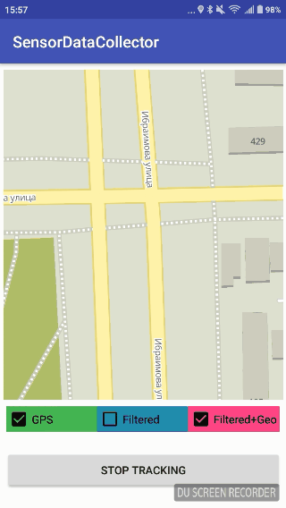

[](https://gps.maddevs.io/)

This is library for GPS and Accelerometer data "fusion" with Kalman filter. All code is written in Java. It helps to increase position accuracy and GPS distance calculation on Android devices for the driver's and couriers' apps. And also, it may be used for precise tracking in on-demand services.

Project consists of 2 parts: <br>
* Main: GpsAccelerationKalmanFusion module; <br>
* 2 helper applications: <br>
Visualiser – https://github.com/maddevsio/mad-location-manager/tree/master/C<br>
Lib Demo – https://github.com/maddevsio/mad-location-manager/tree/master/app 

[Blog (english version)](https://maddevs.io/blog/reduce-gps-data-error-on-android-with-kalman-filter-and-accelerometer/)

[Blog (russian version)](https://medium.com/maddevs-io/ru-reduce-gps-data-error-on-android-with-kalman-filter-and-accelerometer-b81f1026e06c)

[Our site](https://gps.maddevs.io/en/)


[](https://opensource.org/licenses/MIT)
[](https://maddevs.io)

## What can "Mad Location Manager" do?

This module helps to increase GPS coordinates accuracy and also:
* reduces the errors in route tracking;
* decreases the noise from Low-class smartphones;
* excludes sharp «jumps» to the points remote from a real route;
* eliminates additional distance when the object is motionless;
* filters errors duу to the short-term loss of GPS-signal.

## How to install

Use last version from link below (jitpack): 

[](https://jitpack.io/#maddevsio/mad-location-manager)

## How to use
There is example application in current repository called "Sensor Data Collector".



### WARNING!!

Right now these sensors should be available: <br> TYPE_ROTATION_VECTOR, TYPE_LINEAR_ACCELERATION. <br><br>
It's possible to use just TYPE_ACCELEROMETER with high-pass filter.<br> Also it's possible to use Madgwick filter instead of rotation vector, but gyroscope and magnetometer sensors should be available in that case.

### KalmanLocationService

This is main class. It implements data collecting and processing. You need to make several preparation steps for using it:
1. Add to application manifest this: 

```
<service
            android:name="mad.location.manager.lib.Services.KalmanLocationService"
            android:enabled="true"
            android:exported="false"
            android:stopWithTask="false" />
```
2. Create some class and implement LocationServiceInterface and optionally LocationServiceStatusInterface . 
3. Register this class with ServicesHelper.addLocationServiceInterface(this) (do it in constructor for example)
4. Handle locationChanged callback. There is Kalman filtered location WITHOUT geohash filtering. Example of geohash filtering is in MapPresenter class.
5. Init location service settings object (or use standard one) and pass it to reset() function.

#### Important things!
It's recommended to use start(), stop() and reset() methods, because this service has internal state. Use start() method at the beginning of new route. Stop service when your application doesn't use locations data. That need to be done for decrease battery consumption. 

### Kalman filter settings

There are several settings for KalmanFilter. All of them stored in KalmanLocationService.Settings class. 

- Acceleration deviation - this value controls process noise covariance matrix. In other words it's "trust level" of accelerometer data. Low value means that accelerometer data is more preferable. 
- Gps min time	- minimum time interval between location updates, in milliseconds
- Gps min distance - minimum distance between location updates, in meters
- Sensor frequency in Herz - the rate sensor events are delivered at
- GeoHash precision - length of geohash string (and precision)
- GeoHash min point - count of points with same geohash. GPS point becomes valid only when count greater then this value. 
- Logger - if you need to log something to file just implement ILogger interface and initialize settings with that object. If you don't need that - just pass null . 

There is an example in MainActivity class how to use logger and settings.

### GeoHashRTFilter

There are 2 ways of using GeoHash real-time filter : 
* It could be used as part of KalmanLocationService. It will work inside that thread and will be used by service. But then you need to use start(), stop() and reset() methods. 
* It could be used as external component and filter Location objects from any source (not only from KalmanLocationService). You need to reset it before using and then use method filter() .

It will calculate distance in 2 ways : Vincenty and haversine formula . Both of them show good results so maybe we will add some flag for choose. 


## The roadmap
### Visualizer 

- [x] Implement some route visualizer for desktop application
- [x] Implement Kalman filter and test all settings
- [x] Implement noise generator for logged data
- [ ] Improve UI. Need to use some controls for coefficient/noise changes

### Filter 

- [x] Implement GeoHash function
- [x] Get device orientation
	- [x] Get device orientation using magnetometer and accelerometer + android sensor manager
	- [x] Get device orientation using magnetometer, accelerometer and gyroscope + Madgwick AHRS
	- [x] Get device orientation using rotation vector virtual sensor
- [x] Compare result device orientation and choose most stable one
- [x] Get linear acceleration of device (acceleration without gravity force)
- [x] Convert relative linear acceleration axis to absolute coordinate system (east/north/up)
- [x] Implement Kalman filter core
- [x] Implement Kalman filter for accelerometer and gps data "fusion"
- [x] Logger for pure GPS data, acceleration data and filtered GPS data.
- [ ] Restore route if gps connection is lost

### Library

- [x] Separate test android application and library
- [x] Add library to some public repository

## Theory

Kalman filtering, also known as linear quadratic estimation (LQE), is an algorithm that uses a series of measurements observed over time, containing statistical noise and other inaccuracies, and produces estimates of unknown variables that tend to be more accurate than those based on a single measurement alone, by estimating a joint probability distribution over the variables for each timeframe.

You can get more details about the filter [here](https://en.wikipedia.org/wiki/Kalman_filter).

The filter is a de-facto standard solution in navigation systems. The project simply defines the given data and implements some math.

The project uses 2 data sources: GPS and accelerometer. GPS coordinates are not very accurate, but each of them doesn't depend on previous values. So, there is no accumulation error in this case. On the other hand, the accelerometer has very accurate readings, but it accumulates error related to noise and integration error. Therefore, it is necessary to "fuse" these two sources. Kalman is the best solution here.

So first - we need to define matrices and do some math with them. And second - we need to get real acceleration (not in device orientation).

First one is described in current project's wiki. But second one is little bit more complex thing called "sensor fusion". There is a lot information about this in internet.

#### Algorithms

Sensor fusion is a term that covers a number of methods and algorithms, including:

- [Central limit theorem](https://en.wikipedia.org/wiki/Central_limit_theorem)
- [Kalman filter](https://en.wikipedia.org/wiki/Kalman_filter)
- [Bayesian networks](https://en.wikipedia.org/wiki/Bayesian_network)
- [Dempster-Shafer](https://en.wikipedia.org/wiki/Dempster%E2%80%93Shafer_theory)
- [Convolutional neural network](https://en.wikipedia.org/wiki/Convolutional_neural_network)


For real acceleration we need to know 2 things: "linear acceleration" and device orientation.
Linear acceleration is acceleration along each device axis excluding force of gravity. It could be calculated by high pass filter or with more complex algorithms. Device orientation could be calculated in many ways:

- Using accelerometer + magnetometer
- Using accelerometer + magnetometer + gyroscope
- Using [Madgwick filter](http://x-io.co.uk/open-source-imu-and-ahrs-algorithms/)
- Using virtual "rotation vector" sensor. 

Best results show Madgwick filter and ROTATION_VECTOR sensor, but Madgwick filter should be used when we know sensor frequency. Android doesn't provide such information. We can set minimum frequency, but it could be much higher then specified. Also we need to provide gain coefficient for each device. So best solution here is to use virtual ROTATION_VECTOR sensor. You can get more details from current project's wiki.

## Issues

Feel free to send pull requests. Also feel free to create issues.

## License

MIT License

Copyright (c) 2020 Mad Devs

Permission is hereby granted, free of charge, to any person obtaining a copy of this software and associated documentation files (the "Software"), to deal in the Software without restriction, including without limitation the rights to use, copy, modify, merge, publish, distribute, sublicense, and/or sell copies of the Software, and to permit persons to whom the Software is furnished to do so, subject to the following conditions:

The above copyright notice and this permission notice shall be included in all copies or substantial portions of the Software.

THE SOFTWARE IS PROVIDED "AS IS", WITHOUT WARRANTY OF ANY KIND, EXPRESS OR IMPLIED, INCLUDING BUT NOT LIMITED TO THE WARRANTIES OF MERCHANTABILITY, FITNESS FOR A PARTICULAR PURPOSE AND NONINFRINGEMENT. IN NO EVENT SHALL THE AUTHORS OR COPYRIGHT HOLDERS BE LIABLE FOR ANY CLAIM, DAMAGES OR OTHER LIABILITY, WHETHER IN AN ACTION OF CONTRACT, TORT OR OTHERWISE, ARISING FROM, OUT OF OR IN CONNECTION WITH THE SOFTWARE OR THE USE OR OTHER DEALINGS IN THE SOFTWARE.
